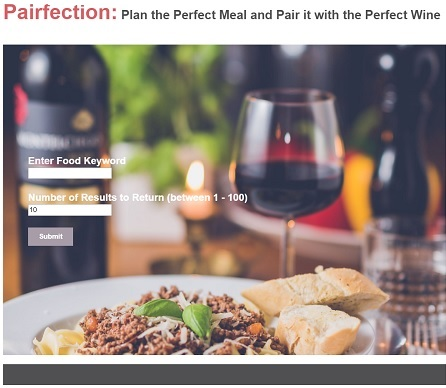
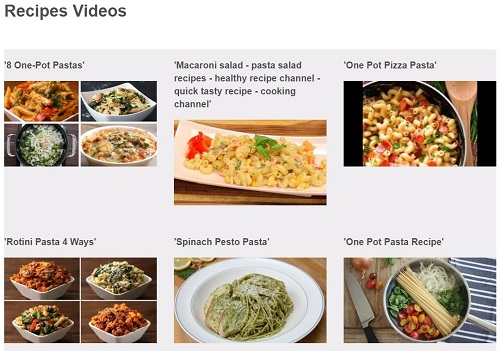
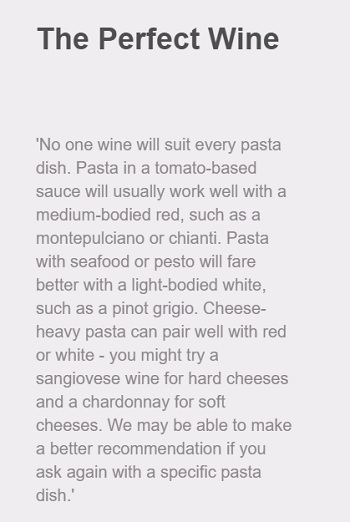

#Pairfection
An application designed for people who want to plan the perfect meal in a short time. Users can pick the video of their choice, watch how to prepare the meal, and get wine recommendation for the meal.  

##Motivation
This was inspired for those days where I have friends and relatives coming over and needing to plan a meal that includes wine without spending unnecessary time scrolling through hundreds of recipes in countless of food sites and figuring out what wine to pair the dish with.

##Screenshots
###Landing page:

 

###Food Videos Results:

 

###Wine results:

 
 
##Built With:

###Front-End:

*   HTML
*   CSS
*   JavaScript
*   jQuery

##Features
*   Search for recipes videos based on the user’s specific query
*   Choose the number of videos results to display
*   Get wine pair recommendation for the user’s query

##Demo
[Live Page](https://wildflowers131.github.io/Pairfection/)
